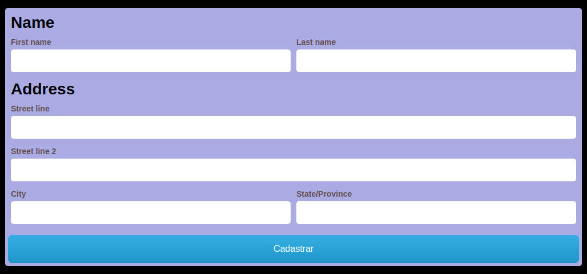

## Screenshots




# Cadastro de Pessoas

Sistema de cadastro de pessoas, usando mockapi como base.


## Tech Stack

**Client:** React.JS, Typescript, Husky,  ESLint Airbnb,  Prettier,  Jest,  React Testing Library,  Storybook,  Styled-component, Formik, Test Coverage, Axios 


## Rodar o projeto

```bash
npm start
```

## Rodando os testes

Para rodar os testes, use:

```bash
  npm run test
```
Para rodar o coverage, use:

```bash
  npm test -- --coverage
```